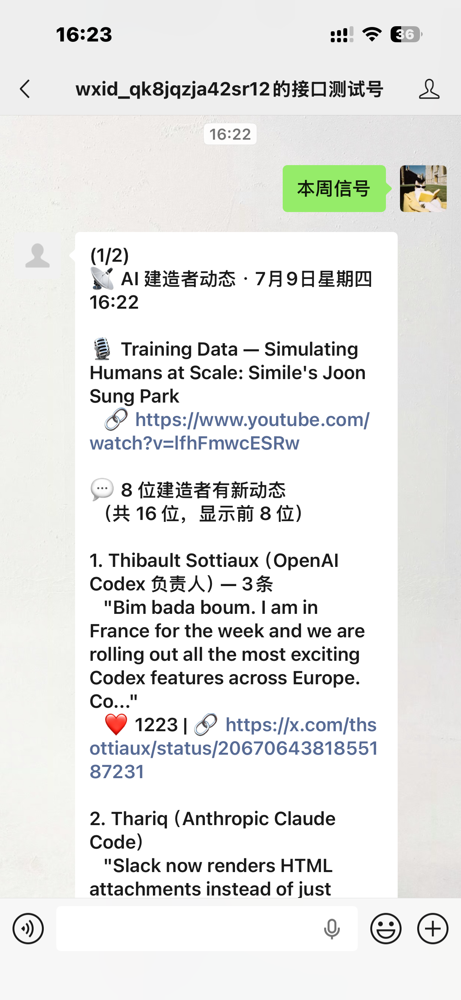
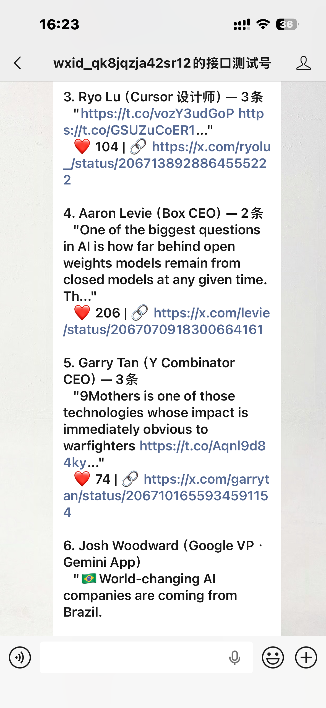
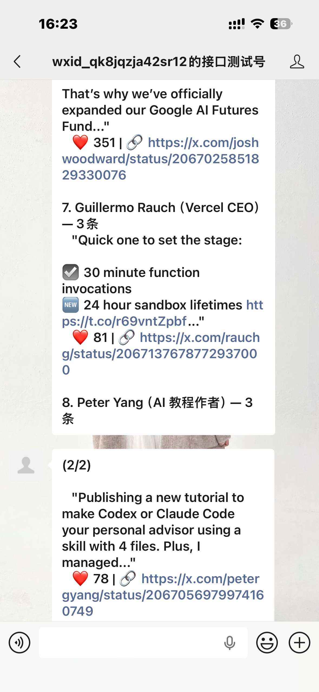

# AI 信号雷达 (AI Signal Radar)

每天 3 分钟，看懂 AI 圈真正重要的事。

一个全自动的 AI 信息策展 Agent。监控 33 个全球顶级 AI 信源（25 位 X/Twitter 建造者 + 6 个播客 + 2 个官方博客），自动完成**抓取 → 翻译 → 评分 → 聚类 → 观点提炼**全链路，最终通过**微信服务号**每日推送精品中英双语 Digest。

> 核心理念来自 [follow-builders](https://github.com/zarazhangrui/follow-builders)："跟踪建造者，而非网红"。

---

## 它能做什么

| 功能 | 说明 |
|------|------|
| 📡 **自动监控** | 追踪 25 位 AI 建造者 + 6 个顶级播客 + 2 个官方博客 |
| 🌐 **全文翻译** | 英→中全文翻译（需 Claude Code），技术术语保留原文 |
| 📱 **微信推送** | 每日定时推送到微信，支持分片、重试、去重 |
| 💬 **对话交互** | 微信内发送指令，实时获取 AI 建造者动态 |
| 📦 **开箱即用** | 自带示例数据，`npm install` 完就能跑通 |

---

## 信源列表

> 核心理念："跟踪建造者，而非网红"。所有信源由 [follow-builders](https://github.com/zarazhangrui/follow-builders) 维护，每天通过 GitHub Actions 自动抓取。

### 💬 X/Twitter 建造者（25 位）

| 账号 | 身份 |
|------|------|
| @karpathy | 前 Tesla AI 总监 |
| @sama | OpenAI CEO |
| @amasad | Replit CEO |
| @rauchg | Vercel CEO |
| @levie | Box CEO |
| @garrytan | Y Combinator CEO |
| @joshwoodward | Google VP · Gemini App |
| @thsottiaux | OpenAI Codex 负责人 |
| @realmadhuguru | 前 Google Gemini PM |
| @trq212 | Anthropic Claude Code 工程师 |
| @alexalbert__ | Anthropic 开发者关系 |
| @AmandaAskell | Anthropic 对齐研究员 |
| @claudeai | Anthropic Claude 官方 |
| @GoogleLabs | Google Labs |
| @swyx | Latent Space 主持人 |
| @mattturck | FirstMark 投资人 |
| @danshipper | Every 联合创始人 |
| @ryolu_ | Cursor 设计师 |
| @petergyang | AI 教程作者 |
| @zarazhangrui | Follow Builders 作者 |
| @nikunj | AI 工程师 |
| @steipete | PSPDFKit 创始人 |
| @adityaag | South Park Commons |
| @bcherny | AI 研究员 |
| @_catwu | AI 产品设计师 |

### 🎙 播客（6 个）

Latent Space · No Priors · Training Data · Unsupervised Learning · The MAD Podcast · AI & I

### 📝 官方博客（2 个）

Anthropic Engineering Blog · Claude Blog

> ⚠️ 本项目**不抓取微信公众号**。config/sources.yaml 为早期方案的历史遗留文件，仅供参考。

---

## 快速开始

### 前置条件

1. **Node.js 18+**
2. **[微信测试号](https://mp.weixin.qq.com/debug/cgi-bin/sandbox?t=sandbox/login)** — 30 秒扫码获取 AppID + AppSecret
3. **[follow-builders](https://github.com/zarazhangrui/follow-builders)** — 数据源（可选，项目自带示例数据）
4. **[Cloudflare Tunnel](https://developers.cloudflare.com/cloudflare-one/connections/connect-networks/downloads/)** — 内网穿透（仅对话交互需要）

### 安装

```bash
# 1. 克隆项目
git clone https://github.com/stella999ssr-boop/ai-signal-radar.git
cd ai-signal-radar

# 2. 安装依赖
npm install

# 3. 配置环境变量
cp .env.example .env
# 编辑 .env，填入微信测试号的 AppID、AppSecret、Token

# 4. （可选）安装实时数据源
git clone https://github.com/zarazhangrui/follow-builders.git \
  ~/.claude/skills/follow-builders
cd ~/.claude/skills/follow-builders && git pull
```

> **💡 没有 follow-builders？** 项目 `data/` 目录自带示例 feed 数据，可以直接跑通查看效果。实时数据需要安装 follow-builders。

### 使用

**方式一：微信对话交互（需要启动服务器）**

```bash
# 终端 1 — 启动微信服务器
npm start

# 终端 2 — 启动内网穿透
cloudflared tunnel --url http://localhost:8787 --protocol http2
```

将隧道 URL 填入微信测试号的接口配置，即可在微信内发送指令交互。

**方式二：微信主动推送**

```bash
# 手动推送一次
node scripts/push-daily.js

# Windows 定时任务（每天 8:00 自动）
schtasks /Create /SC DAILY /TN "AI_Signal_Radar" \
  /TR "cmd /c cd /d C:\path\to\ai-signal-radar && node scripts/push-daily.js" \
  /ST 08:00
```

### 效果截图

#### 微信内查看「本周信号」推送效果

> 提示：将下面 3 张截图保存到 `docs/screenshots/` 目录后，README 会自动展示。

<table>
<tr>
<td></td>
<td></td>
<td></td>
</tr>
</table>

**方式三：Claude Code 内查看（最完整，全文翻译+观点提炼）**

在 Claude Code 中输入 `/ai`，获取带全文翻译 + 深度解读的完整版 Digest。

---

## 项目结构

```
ai-signal-radar/
├── worker/                     # 微信消息服务器
│   ├── index.js                #   Node.js 原生 http — XML 解析 + SHA1 签名
│   └── reply.js                #   对话引擎 — 消息路由 + 本地 feed 摘要
├── scripts/
│   └── push-daily.js           # 微信推送 — 分片 + 重试 + 去重
├── curation/
│   └── weekly.js               # 策展引擎 — 5 维评分 + 关键词聚类
├── config/
│   └── sources.yaml            # 信源分级配置（历史遗留，参考用）
├── prompts/
│   └── curation-prompt.md      # AI 策展 Prompt — 评分维度定义
├── data/                       # 示例数据 + 运行时状态
│   ├── feed-x.json             #   示例 X/Twitter feed
│   └── feed-podcasts.json      #   示例播客 feed
├── .env.example                # 环境变量模板
├── .github/workflows/
│   └── gitguardian.yml         # 可选的密钥扫描
└── package.json
```

## 架构

```
┌──────────────┐    ┌──────────────┐    ┌─────────────┐
│  信源层       │ →  │  AI 策展层    │ →  │  推送层      │
│  follow-      │    │  Claude      │    │  WeChat API  │
│  builders     │    │  翻译+评分    │    │  分片+重试    │
│  28 信源      │    │  +观点提炼    │    │  +去重       │
└──────────────┘    └──────────────┘    └─────────────┘
       ↓                   ↓                   ↓
  本地 Feed 缓存      5 维评分算法         微信测试号
  (+ 项目自带示例)     + Prompt 工程        + CF Tunnel
```

- **[follow-builders](https://github.com/zarazhangrui/follow-builders)**：信源层，GitHub Actions 每天定时通过 X API v2 抓取推文 + 播客转录，生成 feed JSON 文件
- **ai-signal-radar**（本项目）：读取 feed 数据 → 生成中文摘要 → 通过微信服务号推送给用户
- 没有 follow-builders 时，项目降级使用 `data/` 目录下的示例数据，不影响体验流程

## 技术亮点

- **Express 5 → Node.js 原生 http**：发现 Express 5 的 `express.text()` 中间件与 XML 流解析互斥，切原生方案解决
- **QUIC → HTTP2 协议降级**：Cloudflare Tunnel 默认 QUIC 在国内丢包 70%+，`--protocol http2` 修复
- **WeChat API 分片推送**：参考 deliver.js 实现按换行分片 + 3 次重试，突破微信单条字数限制
- **内容去重**：参考 state-feed.json 设计 `push-state.json`，7 天自动清理，跨运行不重复推送
- **优雅降级**：无 follow-builders 时自动回退到项目自带示例数据，不崩溃 + 给出友好提示

## 参考项目

- [follow-builders](https://github.com/zarazhangrui/follow-builders) — 信源层，"Follow Builders, Not Influencers"
- [hex2077.dev](https://hex2077.dev) — 何夕 2077 AI 信号周刊，"信息分层 + 交叉验证 + 深度观点"策展模式
- [PrismFlowAgent](https://github.com/justlovemaki/PrismFlowAgent) — Fastify + LangChain + SQLite 技术栈参考
- [AIHOT](https://aihot.virxact.com) — 168 信源 + DeepSeek 评分，全自动策展

## License

MIT
